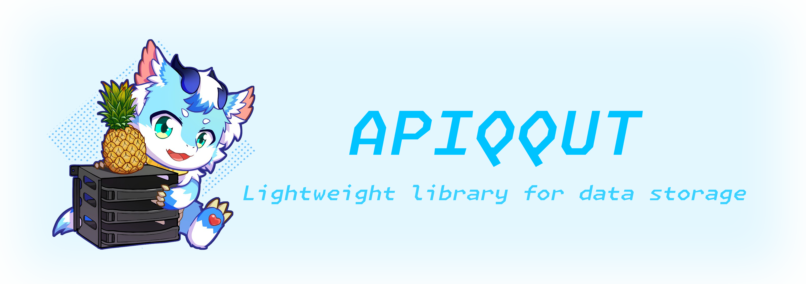

<div align=center>



# Apiqqut · 初雪
### 純淨的輕量級在地數據結構代碼套件

📖 [**Apiqqut wiki**](https://github.com/AmarokIce/Apiqqut/wiki) | 📮 [**問題反饋**](https://github.com/AmarokIce/Apiqqut/issues) | 📚 [**在 Dub 中訪問**](https://apiqqut.dub.pm)

| [**簡體中文**](README.md) | ***正體中文*** | [**English [WIP]**](README.md) |

> 項目仍在開發初期，慎重用於嚴肅開發。 <br />
> 如您遇到任何問題，請及時向我們反饋！ <br />

[](https://dlang.org/)
[](https://www.gnu.org/licenses/agpl-3.0.html)
[](https://ifdian.net/a/AmarokIce)

</div>

**`Apiqqut` 向您問候！您一定在好奇，`Apiqqut` 是什麼？當然，請允許我們向您介紹！`Apiqqut` 是...**
- 數據結構容器的代碼庫：
  - `List`, `Map`, `Table`, `Multimap`... 我們來自 Java, 為了快速解決數據封裝的麻煩，我們準備了這些集合容器。如果您來自 Java, 那麼您會倍感親切——`Apiqqut` 是為您解決麻煩而來的。
- 低耦合化處理的代碼庫：
  - 使用方便易上爪的 `Event` 保持您的數據處理流程不會對當前的環境有過多上下文剛性，這對您持續開發有極佳的好處。
- 在地數據存取的代碼庫：
  - `CSV`，`Json/Json5` 的序列與反序列。您不需要無時無刻考慮塞數據庫，而是更簡單，更適合任何用戶的方式。如果您認同這樣的說法，那麼這就是您正在尋找的。我們正在計畫支援更多...
- 關心面向對象的代碼庫：
  - 我們採用面向對象作為解決方案，最小化我們的代碼庫。我們相信當數據得到正確且良好的分類時，才能真實的減輕工作量。
- 為您服務到底的代碼庫：
  - 你是否真的關心過您的數據存儲方案？我們知道您更希望把精力花費在邏輯代碼上，而不是關心這些“不得不去關心”的瑣事。冇有問題，我們為您服務到底！
- 由狼親爪編寫的代碼庫：
  - 您不關心這個？這樣的話我們會很傷心的誒 QwQ

**您的超酷的項目使用了 `Apiqqut` 會變得...**
- 更酷！
  - `Apiqqut` 的簡單易學習能夠讓任何開發者與興趣驅動者翻閱您的項目時得到更好的體驗！
- 更快！
  - 從設計到運行，使用通用的封裝模闆可以減輕您的工作負擔,我們的預設結構可以幫助您減少結構設計的周期，快速切入主題去開發您關心的部分！
- 更小！
  - 我們關註最小最輕的設計結構，因此我們模塊化設計每一個部分，模塊之間隻會在必要的複用設計的情況下存在關聯。`Apiqqut` 保證不會讓您的依賴組件的體積膨脹！


**準備好開始探索 `Apiqqut` 了嗎？我們這兒有一些您會感興趣的示例：**

**Event:**
```d
import std.stdio : writeln;

// 直接導入整個 event 模塊
import apiqqut.event;

// 創建我們的 Event
class DataEvent : Event {
    string text;
    this(string text) {
        this.text = text;
    }
}

void addHello(DataEvent event) {
    event.text ~= "Hello";
}

void addSpace(DataEvent event) {
    event.text ~= " ";
}

void addWorld(DataEvent event) {
    event.text ~= "world";
}

void addEnd(DataEvent event) {
    event.text ~= "!";
}

void main() {
    // 通過參數來指定訂閱的 Event
    registerEvent(&addEnd, EventPriority.Low);
    registerEvent(&addSpace);
    registerEvent(&addWorld, EventPriority.Common);
    registerEvent(&addHello, EventPriority.High);

    // 創建 Event 對象，並廣播
    auto event = new DataEvent("");
    postEvent(event);

    // "Hello world!"
    writeln(event.text);
}
```


**Collection:**
```d
import std.stdio : writeln;
import apiqqut.collection.list;
import apiqqut.collection.iterator : Iterator;

void main() {
    int[] intArray = new int[0];

    // 創建一個空的 string 類型的 ArrayList
    List!string strList = new ArrayList!string();

    // 從現有的內容創建一個 LinkedList
    List!int intList = new LinkedList!int(intArray);

    // 隨意的添加一些什麼
    strList.add("pineapple");
    strList.add("anana");

    intList.add(114);
    intList.add(514);

    // 創建一個簡單生成器
    Iterator!string strItro = new Iterator(strList);

    while(strItro.hasNext) {
        writeln(strItro.next)
    }

    // 無論是存放還是刪除，我們總是能拿到目標值——我們總是可以內聯處理！
    writeln(intList.removeAt(0));

    // 我們還可以回去！
    intArray = intList.asArray;
}


```

**當然！我們是開源且自由的項目庫！我們歡迎任何人對 `Apiqqut` 作出貢獻！**

**我們遵循 AGNU-v3.0 自由軟體許可證，這意味著你可以...**
- **無需授權的在您的超酷項目中使用！**
- **為 `Apiqqut` 做超酷的貢獻，並自豪的向朋友們描述你的偉大貢獻！**
- **自由拷貝與分發 `Apiqqut`, 與任何朋友們分享！**

**同時，您應該遵守相關的約定...**
- **您需要以相同許可證重新開源您的項目，即便您正在做網路服務。**
- **您不可以掠奪我們的鳳梨。**
